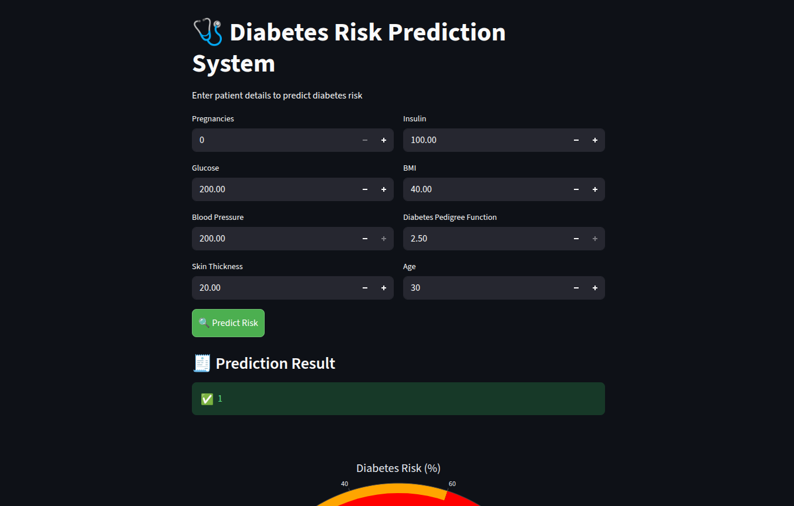
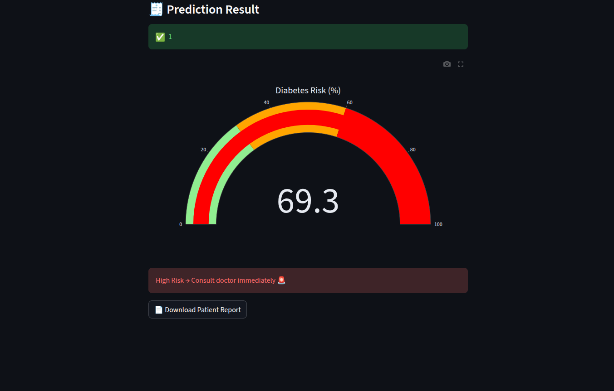

# 🩺 Diabetes Onset Prediction System

<!-- ================= BADGES ================= -->
<p align="center">


<br/>


</p>

A Machine Learning-powered web application that predicts the likelihood of diabetes using patient health parameters.

---


<!-- <p align="center">
  
  
</p> -->

## 🚀 Features

* 🔍 Diabetes prediction using **XGBoost**
* ⚙️ Feature engineering (BMI category, glucose risk, etc.)
* 🎯 Threshold tuning for improved recall
* 🌐 Flask API backend
* 🎨 Streamlit interactive UI
* 📊 Risk visualization (gauge chart)
* 📄 Downloadable patient report (PDF)
* ✅ Input validation for robust predictions

---

## 📊 Model Comparison

| Model                         | Accuracy | Precision (Diabetic) | Recall (Diabetic) | F1 Score | ROC-AUC |
|------------------------------|----------|----------------------|-------------------|----------|--------|
| XGBoost (Threshold=0.30)     | 0.74     | 0.59                 | 0.89              | 0.71     | 0.82   |
| XGBoost                      | 0.75     | 0.62                 | 0.72              | 0.67     | 0.82   |
| Random Forest                | 0.76     | 0.67                 | 0.61              | 0.64     | 0.82   |
| Logistic Regression          | 0.73     | 0.59                 | 0.70              | 0.64     | 0.81   |

📌 In medical applications, recall is prioritized to minimize false negatives (missing diabetic cases).

📌 Threshold tuning improved recall for diabetic cases, making the model more suitable for medical risk prediction.

📌Final model used: **XGBoost with threshold tuning (0.30)**

---


## 🧠 Machine Learning Details

* **Model:** XGBoost Classifier
* **Accuracy:** ~75%
* **F1 Score:** ~0.67
* **ROC-AUC:** ~0.82

### Feature Engineering

* BMI Category
* Age Group
* Glucose Risk
* High Blood Pressure
* High Insulin

---

## 📁 Project Structure

```
Diabetes-onset-prediction/
│
├── app/
│   ├── app.py        # Flask API
│   ├── ui.py         # Streamlit UI
│
├── model/
│   ├── xgb_model.pkl
│   ├── threshold.pkl
│   ├── feature_order.pkl
│
├── data/
│   └── diabetes.csv
│
├── notebook/
│   └── eda.ipynb     # Training + EDA
│
├── requirements.txt
└── README.md
```

---

## ▶️ How to Run Locally

### 1️⃣ Clone Repository

```bash
git clone https://github.com/SrashtiChauhan/Diabetes-onset-prediction.git
cd Diabetes-onset-prediction
```

### 2️⃣ Install Dependencies

```bash
pip install -r requirements.txt
```

### 3️⃣ Run Backend (Flask)

```bash
cd app
python app.py
```

### 4️⃣ Run Frontend (Streamlit)

```bash
streamlit run ui.py
```

---

## 🧪 Sample Input

```json
{
  "Pregnancies": 1,
  "Glucose": 95,
  "BloodPressure": 70,
  "SkinThickness": 20,
  "Insulin": 80,
  "BMI": 22,
  "DiabetesPedigreeFunction": 0.3,
  "Age": 25
}
```

---

## 📊 Output

* Prediction: **Diabetic / Not Diabetic**
* Probability score
* Risk visualization (gauge)
* Downloadable PDF report

---

## 🔐 Notes

* Model files are included for easy execution

---

## ⭐ Future Improvements

* Add authentication system
* Store patient history
* Deploy to cloud (Render / Streamlit Cloud)
* Improve model performance

---

## 🧑‍💻 Author

**Srashti Chauhan**
BTech CSE

